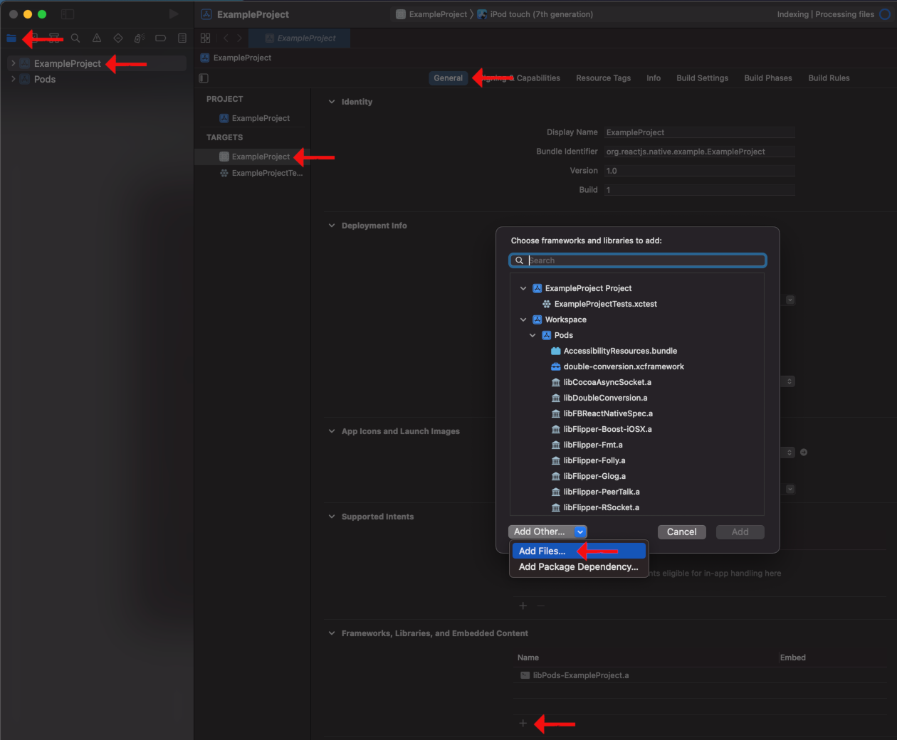
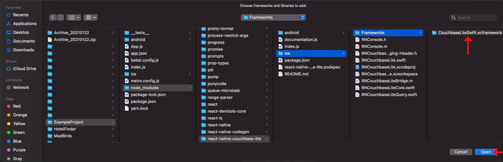

# react-native-couchbase-lite

This repository contains a React Native Module that provides an interface to CouchbaseLite. Currently, only iOS is supported.
  
  
## Table of Contents

  - [What is react-native-couchbase-lite?](#introduction)
  - [How to install](#how-to-install-the-module)
    - [Enterprise Edition](#enterprise-edition)
  - [How to use](#usage)
    - [Basics](#basics)
    - [Query Basics](#query-basics)
    - [Replication](#replication)
  - [Advanced Usage](#advanced-usage)
  
  
## Introduction
react-native-couchbase-lite (RNCouchbaseLite) is a React Native module for using CouchbaseLite in React Native. It currenty only supports iOS, and provides the following features:

  - JSON queries.
  - Database control. Create, Delete, Index
  - Document access. Create, Modify, Metadata
  - Replication with Couchbase Sync Gateway (SGW).

This module uses the CouchbaswLiteSwift-xcframework version 2.8.4 [Docs](https://docs.couchbase.com/mobile/2.8.4/couchbase-lite-swift/).
  
  
## How to install the module

- From your project’s directory, install the module:
```sh
npm install https://github.com/oneok-mobile/react-native-couchbase-lite
```

(The `Enterprise Edition` installation has some [additional steps](#enterprise-edition)) at this point.)
  

- Run the CocoaPods installation:
```sh
cd ios
pod install
```
  
  
- Open `your project's` workspace (`[app]/ios/[app].xcworkspace`) with Xcode.
- Select your Project in the Project Navigator, then select your build target.
- Find the “Frameworks, Libraries, and Embedded Content” section fo the General tab and click the small, “+” icon at the bottom.
- On the “Choose frameworks and libraries to add:” modal, select, “Add Other…” from the “Add Other…” dropdown near the bottom.


  
  
- Navigate to [your project]/node_modules/react-native-couchbase-lite/iOS/Frameworks/CouchbaseLiteSwift.xcframework and click, “Open”.


  

- Clean & Build.
  
  
### Enterprise Edition

Installing RNCouchbaseLite with the Enterprise Edition of CouchbaseLite requires a few additional steps. Additionally, because these changes reside in the node_modules folder, these changes will not be tracked and you may be required to repeat them. It might be advantageous to include these changes in a script.

- Installing the node module (`npm install https://github.com/oneok-mobile/react-native-couchbase-lite`), if you have not already done so.
- [Download](https://www.couchbase.com/downloads) Couchbase Lite ENTERPRISE, Swift-xcframework (2.8.4 is current as of 1/2022)
- Replace `[your app]/node_modules/react-native-couchbase-lite/ios/Frameworks/CouchbaseLiteSwift.xcframework` with the ENTERPRISE edition.
- Open [your app]/node_modules/react-native-couchbase-lite/react-native-couchbase-lite.podspec:
  - Modify the ’s.pod_target_xcconfig’ entry. Change:
```sh
		"SWIFT_ACTIVE_COMPILATION_CONDITIONS" => "CBLCOMMUNITY",
```
			To
```sh
		"SWIFT_ACTIVE_COMPILATION_CONDITIONS" => "CBLENTERPRISE",
```
  
- Continue the [installation instructions](#how-to-install-the-module) in the previous section.
  
  
## Usage

Import the module into your project:
```javascript
import RNCouchbaseLite from 'react-native-couchbase-lite';
```
  

### Basics

Database name (`databaseName`) is optional in all calls. Default name is `cbdb`

- Save Document. Just about any JS object can be saved as a document. A document-id is generated by CouchbaseLite.
```javascript
const document = {
	type : 'garbage',
	foo  : ['boop', 'beep'],
	bar  : 14.7,
	baz  : {
		bork : true,
		bark : ['bananas']
	}
};

// Save:
const documentId = await RNCouchbaseLite.saveDocument({ databaseName, document });
```
  

- You can also specify a document-id, if you don't want an auto-generated one:
```javascript
await RNCouchbaseLite.saveDocument({ databaseName, document: { id: 'GarbageRecordAlpha1', ...document } });
```
  

It is recommended that you use your own identity fields for records when laying out your database design. The CouchbaseLite document `id` has some special behaviors.

- Get Document. A document can be retrieved by its' document-id, but the document-id is not included in the returned document by default.
```javascript
const documentFromDB = await RNCouchbaseLite.getDocument({ databaseName, documentId }); // Document is anonymous
```
  

Deleted documents cannot be retrieved this way. Use `getDocuments` with the isDeleted META: tag to get deleted documents.

- Update Document.
```javascript
documentFromDB.id = documentId; // Include an existing document-id to update an existing record
documentFromDB.bar *= 1.00014; // (make change(s))
documentFromDB.baz.bark[0] = 'bandanas';
await RNCouchbaseLite.saveDocument({ databaseName, document: documentFromDB }); // This will fire change events, even if the saved and old documents are the same.
```
  

- Delete Document.
```javascript
await RNCouchbaseLite.deleteDocument({ databaseName, documentId });
```
  
  
### Query Basics

- Get All Documents.
```javascript
const documents = await RNCouchbaseLite.getDocuments(); // 'cbdb' is the default database
```
  

Specify database with the 'from' property. Non-existent databases are automatically created.
```javascript
const documents = await RNCouchbaseLite.getDocuments({ from: databaseName });
```
By default, all document properties are returned, but not 'id' (document-id)
  
  
- Use the 'select' property to specify a list of properties to include in the returned documents.
```javascript
const documents = await RNCouchbaseLite.getDocuments({
	select	: ['id', 'numProp', 'stringProp'],
	from	: databaseName
});
```
The 'id' property (document-id) can also be specified. Properties that do not exist on a document will be ignored.
  
  
- Use the 'limit' property to return the first n results from the possible resultset.
```javascript
const documents = await RNCouchbaseLite.getDocuments({
	from	: databaseName,
	limit	: 2
});
```
  
  
- Use the 'offset' property to skip the first n results from the possible resultset
Use the 'offset' property together with the 'limit' property together for pagination
```javascript
const documents = await RNCouchbaseLite.getDocuments({
	from	: databaseName,
	limit	: 2,
	offset	: 6
});
```
  
  
- Filter results with the `where` property. By default, each key:value pair is a left:right equal-to comparator where 'left' (the key) is a property-name expression and 'right' (the value) is a static value expression (number, string, boolean, etc.).
```javascript
const documents = await RNCouchbaseLite.getDocuments({
	select	: ['numProp', 'stringProp'],
	from	: databaseName,
	where	: [{ numProp: 2 }]
});
```
  
  
`where` is a list of objects. Each object is connected by a logical 'OR', while each key:value pair is connected by a logical 'AND'.
This query retrieves the 'id', 'type' & 'numProp' properties for every document that has a (type of 'example' AND a numProp of 3) OR has a (type of 'garbage'):
```javascript
const documents = await RNCouchbaseLite.getDocuments({
	select	: ['id', 'type', 'numProp'],
	from	: databaseName,
	where	: [{ type: 'example', numProp: 3 }, { type: 'garbage' }]
});
```
  
  
- child and grandchild properties are addressed using dot-notation.
```javascript
const documents = await RNCouchbaseLite.getDocuments({
	select	: ['objectProp'],
	from	: databaseName,
	where	: [{ type: 'example', 'objectProp.objectProp.bar': 42 }]
});
```
  
  
- Expressions can include special commands to modify them.
Here, we are using the PROP: command to create a property-expression for 'objectProp.boolProp' instead of the default, static value-expression:
```javascript
const documents = await RNCouchbaseLite.getDocuments({
	select	: ['boolProp', 'objectProp.boolProp'],
	from	: databaseName,
	where	: [{ type: 'example', boolProp: 'PROP:objectProp.boolProp' }]
});
```
  
  
- The left expression (keys) can use commands, too.
Here, we are using the UPPER: command to uppercase the 'stringProp' property and compare it to the string, 'PIZZA':
```javascript
const documents = await RNCouchbaseLite.getDocuments({
	select	: ['stringProp'],
	from	: databaseName,
	where	: [{ type: 'example', 'UPPER:stringProp': 'PIZZA' }]
});
```
  
  
- Expression commands can be chained and are available in select-expressions. Additional parameters for commands are delimited by forward-slashes. Math commands are partially available - right-side expressions aren't supported, only numbers.
```javascript
const documents = await RNCouchbaseLite.getDocuments({
	select	: ['ROUND/3:DIVIDE/7:decimalProp', 'UPPER:objectProp.stringProp'],
	from	: databaseName,
	where	: [{ type: 'example' }]
});
```
  
  
- Aliases are assigned with the '=' delimiter.
```javascript
const documents = await RNCouchbaseLite.getDocuments({
	select	: ['LENGTH:objectProp.stringProp=stringLength', 'LENGTH[]:arrayProp=arrayLength', 'STRING:This is a static string.=stupidString'],
	from	: databaseName,
	where	: [{ type: 'example' }]
});
```
  
More [advanced features](#advanced-usage) are available. (Comperators, Joins, Grouping, and Ordering)
  
  
### Replication

- Start a replicator:
```javascript
const replicatorName = await RNCouchbaseLite.startReplicator({
	databaseName	: undefined, // (Optional) Defaults to 'cbdb'
	target			: '', // Example: "wss://10.1.1.12:8092/actDb"
	replicatorType	: 'pushAndPull', // push, pull, pushAndPull (default)
	continuous		: true, // false = adhoc. Adhoc replication stops when finished
	channels		: ['example'], // A list of channels to sync. By default, all channels are replicated. Channels are determined by the sync function in the SyncGateway config file.
	documentIDs		: ['df8b365727bd467e355881f7530794fd', 'GarbageRecordAlpha1'], // A list of documents (by id) to sync. By default, all documents are replicated.
	name			: 'testReplicator1', // A unique handle for the replicator oject. By default, a name is generated.
	heartbeat		: 30, // Websockets keep-alive heartbeat interval in seconds. Default is 300 seconds (5 minutes)
	selfSigned		: false, // Allows connections with servers with self-signed certificates. Enterprise only. DO NOT USE THIS! See https://letsencrypt.org/
	certificateURL	: 'https://xxxxxxx', // The URL of the pinned certificate to use with the replicator connection.
	certificate		: 'Rm9yIEV4YW1wbGU=', // Base64 encoded string containing the pinned certificate to use with the replicator connection.
	authenticationType	: '', // 'BASIC' or 'SESSION'. Defaults to 'SESSION'
	username		: 'testuser1', // Required if authenticationType is set to 'BASIC'
	password		: 'coolest password ever', // Required if authenticationType is set to 'BASIC'
	sessionID		: '', // Required if authenticationType is 'SESSION'. This is the session token.
	headers			: { 'x_client_secret': 'fks04iufbe8hd' }, // A list of additional HTTPS (WSS) headers to use with every request.
	allowReplicatingInBackground	: false, // Replicate even when app is in the background. (If setting the value to [true], please [get user/device permission] properly.) Note: iOS doesn't seem to allow this for more than a moment.
	enableAccessRemovedEvent : false, // Fire the 'Replication.Pull.AccessRemoved' event when the user remotely loses access to a document.
	enablePullDeleteEvent : false, // Fire the 'Replication.Pull.Delete' event when a file is remotely deleted. (Documents won't delete locally if they are caught in the pull filter)
	verboseEvents	: false, // Include more data about sync updates in some events. This could potentially cause performance issues if large amounts of data are generated at once.
	resetCheckpoint	: false, // When the local checkpoint is reset, the replicator will sync all changes since the beginning of time from the remote database.
	// Documents matching the push or pull filters will be excluded from push or pull replication respecively. String, Number, and Boolean values can be used.
	pushFilter		: { match: { status: 'complete' } }, // If the 'match' filter is defined, a document must match at least one of the defined filter properties.
	pullFilter		: { not: { type: ['junk', 'testA', 'person', 'event'] } }, // If the 'not' filter is defined, a document must not match any of the defined filter properties.
});
```

- Stop Replicator
```javascript
await RNCouchbaseLite.stopReplicator({ replicatorName });
```
  
  
## Advanced Usage

More detail and more advanced features are documented further in the [documentation.js file](documentation.js).
  

  
